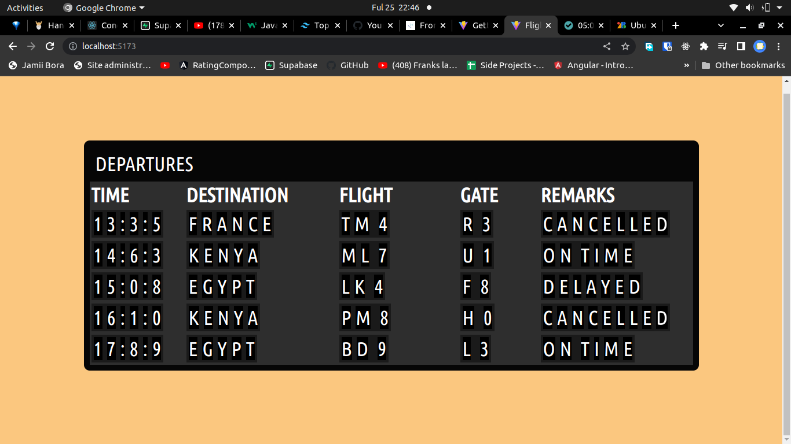

# rotating-flight-widget
A flight widget showing departure times created using vanilla javascript

## Table of contents

- [Overview](#overview)
  - [The challenge](#the-challenge)
  - [Screenshot](#screenshot)
  - [Links](#links)
  - [Built with](#built-with)
  -[Installation](#Installation)
- [Acknowledgments](#acknowledgments)

## Overview

### The challenge

Users should be able to:

- Display time, destination, remarks and gate details for a particular flight in table form.

### Screenshot

### Links
- Live Site URL: [URL here](https://6330b18297f4e60008959e29--ephemeral-phoenix-7eb38f.netlify.app/)

### Built with

- Semantic HTML5 markup
- CSS custom properties
- Flexbox
- Vanilla Javascript

### Installation
- Clone the project with the following command: `https://github.com/Clinton-dev/rotating-flight-widget.git`
- Switch to the directory with project using `cd rotating-flight-widget`
- Install dependancies by typing the following command in your terminal `npm install`
- Run the project `npm run dev`
- Open browser and go to the following url `http://localhost:5173/` 

## Acknowledgments

-Code with Ania Kubow [youtube](https://youtu.be/xs5aOs-Wpxw)

